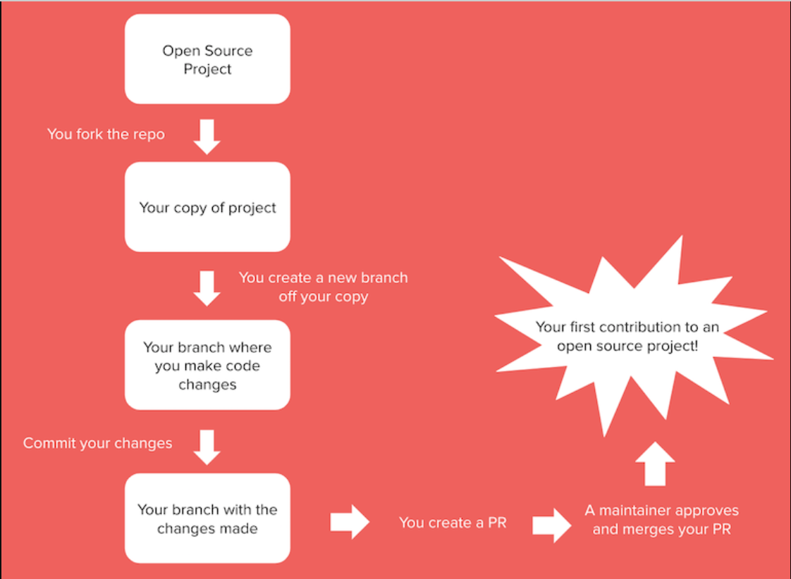

# The Essential Cheat Sheet for Open Source Projects

### What is Open Source?
Open source software is software with source code that anyone can inspect, modify, and enhance. Anyone who has Internet access can benefit from Open Source Software.

### Basics of Open Source Projects
- **Popular Open Source Platforms:**
  - [GitHub](https://github.com/)
  - [GitLab](https://gitlab.com/)
  - [Bitbucket](https://bitbucket.org/)

- **Keywords when starting with Open Source:**
  - Forking
  - cloning
  - committing
  - pushing
  - opening pull requests

- **Key Concepts:**
  - **Open Source Communities:** Groups of developers and non-coders who collaborate on open source projects.
  - **Source Code:** The original code which can be viewed, modified, and distributed under an open source license.
  - **License:** Terms under which Open Source Software can be used, modified, and distributed.
  - **Contribute:** It can take the form of debugging, fixing code, making corrections to project documents. Anyone can contribute to Open Source Projects regardless of their coding skills.
  - **Forking:** A copy of a repository owned by an organization, community, or user. It allows the user to experiment, make changes in the forked repository, and then make a pull request to the original project for their changes to be included.
  - **Cloning:** Creates a copy of a repository from a remote server to a local one.
  - **Tag:** A keyword through which to look for projects.

- **Key Components of Open Source Projects:**
  - Maintainers
  - contributors
  - source code repository
  - project license

### Exploring Open Source Projects
- **Finding Projects:**
  - Choose a project based on your skill level and interests. You can search them by:
    - programming language
    - category
    - tags.

- **Categories to Begin Looking for Your Next Project:**
  - Programming Languages
  - Frameworks and Libraries
  - Data Engineering
  - DevOps and Cloud
  - Web Development
  - Mobile Development
  - Game Development
  - Security
  - Miscellaneous

- **Tags You Can Use:**
  - ‘good-first-issue’,
  - ‘beginner-friendly’,
  - ‘first-timers-only’,
  - ‘easy-pick’,
  - ‘starter-project’,
  - ‘newbie-friendly’,
  - ‘intermediate’,
  - ‘medium-difficulty’,
  - ‘improvement-needed’,
  - ‘enhancement’,
  - ‘feature-request’,
  - ‘bug-fix’,
  - ‘up-for-grabs’,
  - ‘help-wanted’

- **Explore Curated Lists:**
  - [CodeTriage](https://www.codetriage.com/)
  - [FirstTimersOnly](https://www.firsttimersonly.com/)
  - [Up For Grabs](https://up-for-grabs.net/)
  - [Awesome for Beginners](https://github.com/MunGell/awesome-for-beginners)
  - [First Contributions](https://firstcontributions.github.io/)
  - [CodeTribute Mozilla](https://codetribute.mozilla.org/)
  - [Ovio](https://ovio.org/how-it-works)
  - [Awesome OSS](https://github.com/sereneblue/awesome-oss)
  - [Skillcrush](https://skillcrush.com/blog/what-is-open-source/)

### Getting Started
1. Create a [GitHub](https://github.com/) account.
2. Familiarize yourself with **[Git](https://git-scm.com/doc)** and **[Version Controlling](https://www.atlassian.com/git/tutorials/what-is-version-control)**.

- **Getting Involved with Open Source:**
  - Creating your own Open Source Project.
  - Contributing to an existing Open Source Project.

- **Upon Landing on an Open Source Project:**
  - **The README File:** Contains all you need to know about the project and where to find information.
  - **The Code of Conduct:** Includes all the rules that the Community will abide by.
  - **The CONTRIBUTING.md:** Details all you need to know before you start contributing to a project, including commit messages and pull requests.
  - **LICENSE**

- **Next Steps:**
  - Land on **“Issues”** and browse through them to understand where you can help the project. Issues that need immediate help are usually tagged with **help-wanted**. Once you find the issue you are interested in solving, start interacting with the Maintainer to take up the issue and ask any necessary questions.

- **Common Types of Contributions:**
  - Reporting bugs and issues.
  - Writing documentation.
  - Fixing bugs.
  - Adding features.
  - Leading development efforts.
  - Documentation and translations.
  - Design and user interface.
  - Organizing and event planning.
  - Code review and testing.

### How to Make a Contribution?
1. Follow these steps:
   
   Image from [Skillcrush](https://skillcrush.com/blog/what-is-open-source/)

- **Maintaining a Respectful and Inclusive Environment:**
  - Read and abide by the project’s documentation, coding standards, and contribution process. Respect the community’s norms and etiquette, including how to report, respond to comments, make commits, and pull requests.
  - Open Source is about collaborating with others: Be polite, constructive, and responsive to feedback from maintainers and other contributors.
  - Start small—keep doing it—think big: Start by tackling small tasks and making small pull requests, then make incremental changes. Keep your documentation clear, preferably by using markdown.

### Benefits of Contributing to Open Source
- Enhance your coding skills and learn from experienced developers:
  - Understanding Git and GitHub.
  - Familiarity with other version control systems (e.g., SVN, Mercurial).
  - Understanding software development processes, concepts, and data structures.
  - Increasing knowledge of common programming concepts and data structures.
- Improve communication skills and problem-solving abilities.
- Gain confidence in working in teams and collaborating with others, possibly through digital collaboration tools (e.g., Slack, Trello, Asana).
- Understand project management and issue tracking.
- Build a strong portfolio and showcase your work to potential employers.
- Gain valuable experience in collaboration and communication.
- Become part of a global developer community.
- Give back to the software development world.

### Additional Resources
- **Git and GitHub:**
  - [Pro Git Book](https://git-scm.com/book/en/v2)
  - [GitHub Guides](https://docs.github.com/en)

- **Open Source Licenses:**
  - [Choose an Open Source License](https://choosealicense.com/)
  - [Open Source Initiative](https://opensource.org/licenses)

- **Contribution Guidelines:**
  - [How to Contribute to Open Source](https://opensource.guide/how-to-contribute/)
  - [First Contributions](https://firstcontributions.github.io/)

- **Open Source Communities:**
  - [Mozilla Open Source](https://www.mozilla.org/en-US/about/forums/)
  - [Apache Software Foundation](https://www.apache.org/foundation/getinvolved.html)
  - [Kubernetes Community](https://github.com/kubernetes/community)

- **Learning Platforms:**
  - [Coursera: Open Source Software Development](https://www.coursera.org/courses?query=open%20source%20software%20development)
  - [Udacity: Version Control with Git](https://www.udacity.com/course/version-control-with-git--ud123)
  - [FreeCodeCamp](https://www.freecodecamp.org/)

- **Project Ideas and Inspiration:**
  - [Awesome Open Source](https://awesomeopensource.com/)
  - [Open Source Friday](https://opensourcefriday.com/)
  - [CodeNewbie](https://www.codenewbie.org/)

- **Online Tools:**
  - [Markdown Guide](https://www.markdownguide.org/)
  - [Asciidoc](http://asciidoc.org/)
  - [Swagger](https://swagger.io/)

### Explore these resources and effectively contribute to open source projects and enhance your skills and experience in software development.
